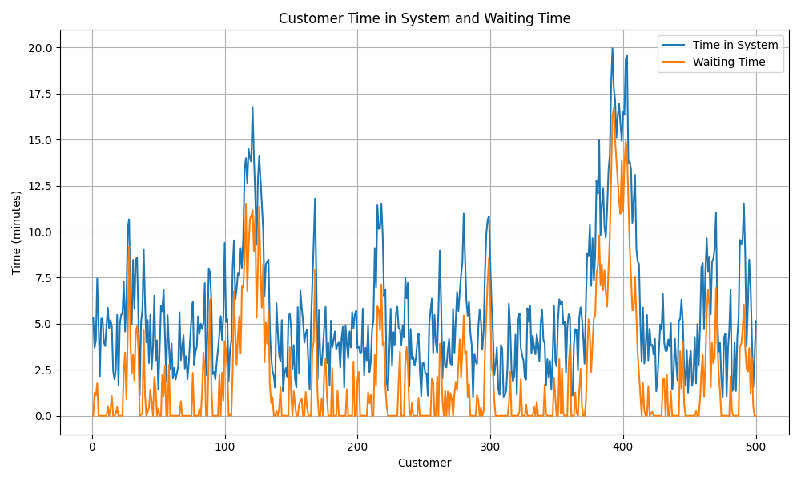
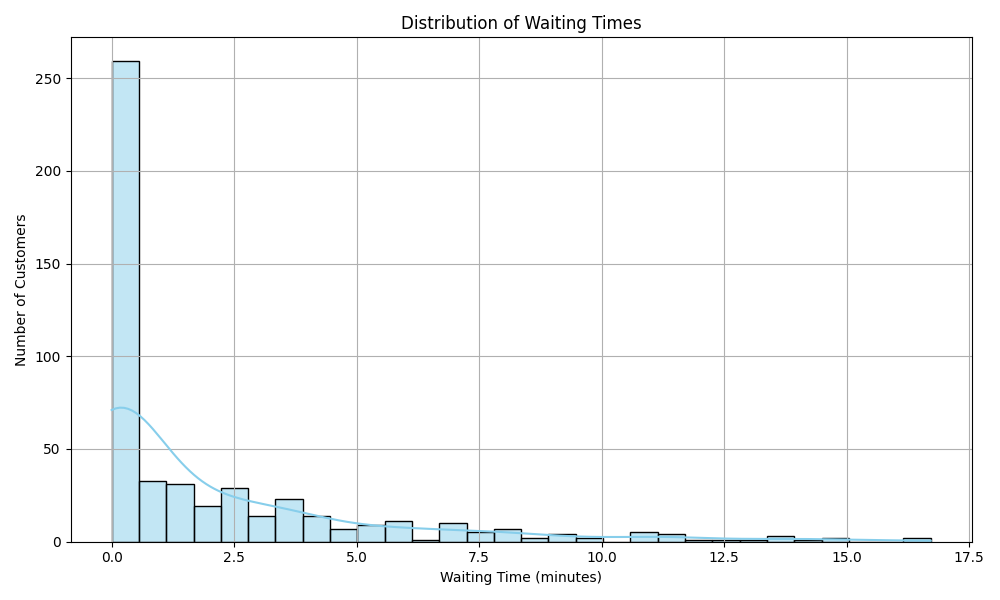

# 🏦 Bank Queue Simulation
A discrete-event simulation of a bank queue with 500 customers using Python

This project simulates a single-server queue at a bank using **discrete-event simulation** in Python for **500 customers**.

## 📌 Features

- Uniform inter-arrival times: 1–8 minutes
- Uniform service times: 1–6 minutes
- FIFO discipline
- Performance metrics: average waiting time, service time, total time in system
- Visualizations of queue behavior

## 📂 Files

| File                            | Description                                   |
|---------------------------------|-----------------------------------------------|
| `bank_queue_simulation.py`     | Main simulation code                          |
| `bank_queue_simulation.csv`    | Simulation output data (500 rows)             |
| `waiting_time_distribution.png`| Histogram of customer waiting times           |
| `time_in_system_vs_waiting_time.png` | Line chart of waiting & system time     |
| `report.pdf`                   | Final report summarizing the simulation       |

## 🖼️ Sample Visualizations
### Time in System vs Waiting Time


### Waiting Time Distribution


## 📈 Summary Metrics (from Terminal)


## ✅ How to Run

### 1. Install dependencies:

```bash
pip install pandas matplotlib seaborn
```

### 2. Run the simulation:
   
```bash
python bank_queue_simulation.py
```

### 3. Outputs:

- CSV file with all stats
- Two PNG visualizations
- Stats printed in terminal

